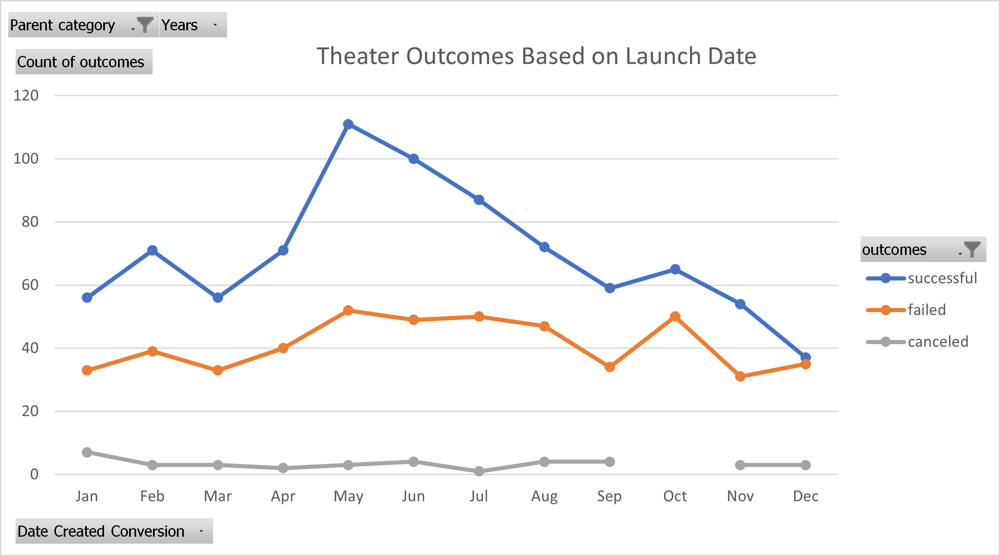
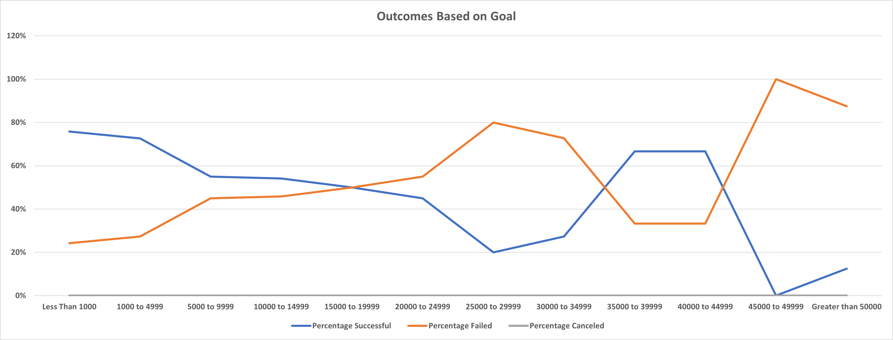

# Kickstarting with Excel

## Overview of Project

### Purpose

We are analyzing kickstarter data to uncover the trends of successful campaigns in order to help Louise make better decisions about her own campaigns. Louise is primarily concerned with theater, particularly plays. She wants to better understand how the launch date and funding goals affected the outcomes of the kickstarters, and use that information to determine dates and goals to shoot for. 

## Analysis and Challenges

### Analysis of Outcomes Based on Launch Date

First, a Years column was created using the [YEAR() function](https://support.microsoft.com/en-us/office/year-function-c64f017a-1354-490d-981f-578e8ec8d3b9) on the Date Created Conversion column. A pivot table was then created with Date Created Conversion for rows, outcomes for columns, count of outcomes for values, and Parent category and Years for the filters. The rows were made sure to be each month, columns were filtered to only include "successful", "failed", and "canceled" in that order, and the Parent category filter was set to theater. With that, a pivot chart was created as a line chart with markers, and a chart title was added, all of which can be seen in the image below. 

### Analysis of Outcomes Based on Goals

A new sheet was created with the eight headers: Goal; Number Successful, Failed, and Canceled; Total Projects; and Percentage Successful, Failed, and Canceled. There were twelve ranges for the Goal column starting from less than 1000, and going up to greater than 50000. The Number Successful, Failed, and Canceled were each calculated using the [COUNTIFS() function](https://support.microsoft.com/en-us/office/countifs-function-dda3dc6e-f74e-4aee-88bc-aa8c2a866842) filtered on the corresponding "outcome" and "goal", as well as on the subcategory "plays". All three were summed up for each row in the Total Projects column, which was then used to calculate the percentage of each. Finally, a line chart was created with Goal on the x-axis, and the Percentage of each Outcome on the y-axis, as shown in the image below. 

### Challenges and Difficulties Encountered

One potential challenge for the Theater Outcomes Based on Launch Date pivot chart was making sure that the rows only included the Date Created Conversion as months, and any additional Excel generated values were removed. For the Outcomes Based on Goal, it was critical to double check every COUNTIFS() statement, making sure that the filters for the "goal" were getting the correct range by using the greater than and less than signs in the right places. It also helped to sum up all the rows for each "outcome" and make sure that it was equal to the total number of kickstarters with that "outcome". Finally, I had to change the Percentage columns data types to Percentage (I kept it with two numbers after the decimal), and then change Axis Options Number for the percentages shown in the y-axis to show 0 decimal places. 

## Results

- What are two conclusions you can draw about the Outcomes based on Launch Date?

May, June, and even July appear to be the best months to launch a theater kickstarter, since there are far more successful than failed campaigns. December, November, and October appear to be the worst months because the number of successful and failed campaigns are much closer. 

- What can you conclude about the Outcomes based on Goals?

In general, it seems that smaller goals (less than $15000) are more likely to succeed and larger goals (more than $20000) are more likely to fail. Goals from $35000 to $44999 were actually more likely to succeed, but this may be due to only have 9 total data points in that range, which may not be representative of the population.

- What are some limitations of this dataset?

In the Theater Outcomes Based on Launch Date data, there isn't much we can say about canceled outcomes as there are too few to judge and we are also missing an entry for October, which would likely need to be filled in as 0. In the Outcomes Based on Goal data we have fairly small sample sizes for the mid to large goal ranges. This means we may not have enough data to accurately understand the population and make future predictions. Another potential issue I found in the dataset is that different countries use different currencies, so unless the goal and pledged amounts were already adjusted to US dollars, then we would not be able to make proper comparisons between these projects without a conversion. Finally, in some of the earlier analyses it appeared that there were outliers in the data. These would need to be checked for possible errors, or taken into account when performing other analyses. 

- What are some other possible tables and/or graphs that we could create?

We could calculate the number of days the campaigns were active for and create a table of descriptive statistics for each outcome, as well as histograms for each. Box and Whisker plots could also be made to compare Percentage Funded with staff picks (whether true or false), or spotlight (whether true or false). 
